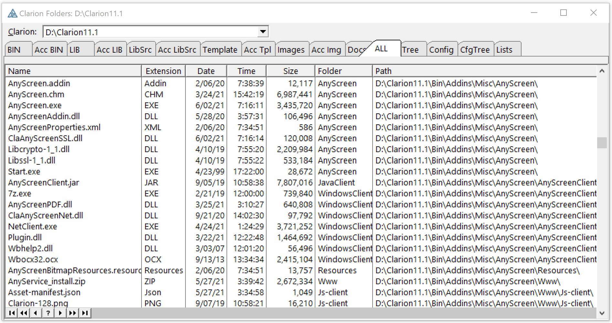
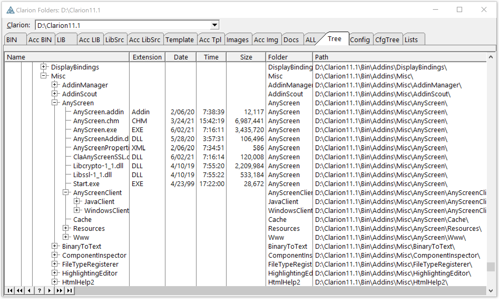

# Clarion Folders
 -------------------------
See all the Clarion IDE folders and files in LIST's. 
 This **REQUIRES Clarion 11.13505** to use new LIST PROP to get reference to FROM Queue.
 It may be fixed to to work with older versions.

Example of things ...

* New C9 List Column sort PROPLIST:HasSortColumn sends EVENT:HeaderPressed
* CLass to encapsulate List Sort by Column
* Recursive Directory load
* Find Clarion installs in Registry
* ... more ...
 

This has example code to recursively load a directory and subdirectories into a queue. 
 The results are presented in a LIST as "flat" on the ALL tab or as a "tree" on the Tree tab

